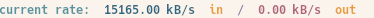

# go-io-monitor
[](https://opensource.org/license/mit)

This library provides a passthru reader to provide bandwidth status updates.


## Installation Instructions

Add [terminatewithextremeprejudice/go-io-monitor](https://github.com/terminatewithextremeprejudice/go-io-monitor) as a dependency to your project:

```cli
go get github.com/terminatewithextremeprejudice/go-io-monitor
```

## Usage Examples

These examples demonstrate how to use [terminatewithextremeprejudice/go-io-monitor](https://github.com/terminatewithextremeprejudice/go-io-monitor) as a library.


The simplest way to use the library is to call the `NewMonitor` and `NewReader` function. `NewReader` returns a `io.Reader` which you need to use from there on. `Monitor` has a method `Status` which returns the underlying struct holding info about the IO flowing through the `Reader`.

```go
// display some real time bandwidth measurements
wg := sync.WaitGroup{}
ch := make(chan bool)
trafficMonitor := NewMonitor(0, 0)

wg.Add(1)
go func() {
	for {
		select {
			case <-ch:
				wg.Done()
				return
			default: {
				cmd := exec.Command("clear") //Linux example, its tested
				cmd.Stdout = os.Stdout
				cmd.Run()
				fmt.Println(Purple(fmt.Sprintf("current rate: ")), Green(fmt.Sprintf("%.2f kB/s", float64(trafficMonitor.Status().CurrentRate)/1024)), Yellow(" in"), Magenta(" / "), Red(fmt.Sprintf("%.2f kB/s", 0.0)), Yellow(" out"))
				time.Sleep(100 * time.Millisecond)
			}
		}
	}
}()

resp, err := http.Get("...")
if err != nil {
    ...
}
inputPipe := NewReader(trafficMonitor, resp.Body)
n, err := io.Copy(io.Discard, inputPipe)
if err != nil {
    ...
}
inputPipe.Close()
ch <- true
close(ch)
wg.Wait()
```

